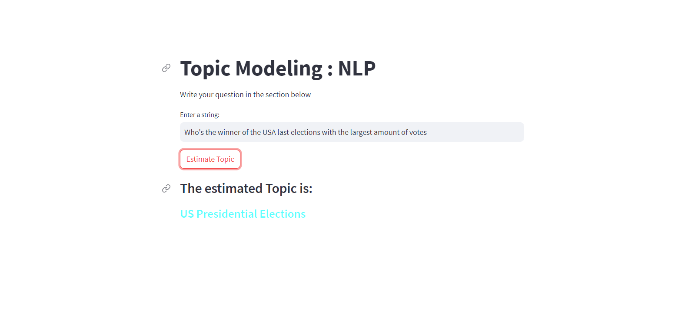

# Topic Modeling Web App with Machine Learning 📚💻



Welcome to the Topic Modeling Web App powered by Machine Learning! This application utilizes natural language processing (NLP) techniques to identify the topics in a given text. Whether you're a data enthusiast or a curious learner, this app can help you explore the hidden themes within textual content.

## Table of Contents

- [Overview](#overview)
- [Data Analysis and Model Building](#data-analysis-and-model-building)
- [Web Application with Streamlit](#web-application-with-streamlit)
- [Getting Started](#getting-started)
- [Prerequisites](#prerequisites)
- [Installation](#installation)
- [Usage](#usage)
- [Contact](#contact)

## Overview

In this project, we use real-world [data](https://drive.google.com/file/d/1u_WTgFmcZTCAfNo3tXvGwBXt19btch9Y/view?usp=sharing)  to build a topic modeling machine learning model. The goal is to identify the topics present in textual data. We'll leverage the power of Natural Language Processing (NLP) to achieve this. The project is divided into two main parts:

1. **Data Analysis and Model Building:** We analyze the data, perform data cleaning, preprocessing, and build an NLP model using scikit-learn. The data is transformed using TF-IDF, and we apply Negative Matrix Factorization (NMF) to define the topics. After labeling the data based on the top 15 words of each topic, a pipeline is constructed using `TfidfVectorizer()` and `LinearSVC()`. The trained model is then saved for future use.

2. **Web Application with Streamlit:** We develop a user-friendly web application using Streamlit. Users can input their text, and the model predicts the most likely topic of the given text.

## Data Analysis and Model Building

The process of data analysis, preprocessing, and model building can be found in the [Topic_Modeling_Project.ipynb](https://colab.research.google.com/drive/1B-QvuNhchbBC03XKh5MMmh78ffpQ61T0?usp=sharing) Jupyter Notebook.

## Web Application with Streamlit

The Streamlit-based web application is built in the [model.py] Python file. This app provides an intuitive interface for users to input their text and get predictions about the topics present in the text.

## Getting Started

To get started with this project, follow these steps:

### Prerequisites

Make sure you have the following installed:

- Python 3.7+
- Streamlit 0.87.0
- sklearn 1.2.2

### Installation

1. Clone the repository:

```bash
git clone https://github.com/your-username/your-repo.git
cd your-repo
```
2. Install the required dependencies:
```
pip install -r requirements.txt
```

### Usage

1. Run the Streamlit app:
   ```
   streamlit run model.py
   ```
2. Open your web browser and navigate to the provided link
3. Input your text and see the predicted topic!


### Contact

For any inquiries, feel free to reach out at [oussamaelhansali@gmail.com](mailto:oussamaelhansali@gmail.com).
If you have any questions or suggestions. Happy coding! 😄🚀
